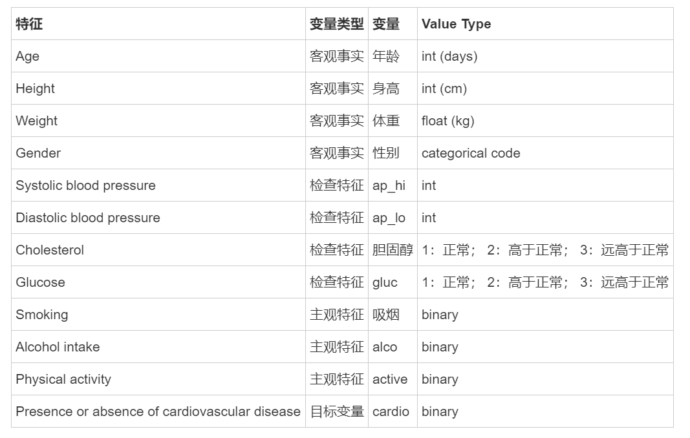

# [心血管疾病数据](https://www.kaggle.com/sulianova/cardiovascular-disease-dataset)

## 数据集概述
数据集包括年龄、性别、收缩压、舒张压等12个特征的患者数据记录7万份。 当患者有心血管疾病时，目标类“cardio”等于1，如果患者健康，则为0。

## 任务
其任务是利用患者的检查结果预测心血管疾病(CVD)的存在与否。

## 数据描述
有三种类型的输入特征:
**Objective**: 客观事实;
**Examination**: 体检检查结果;
**Subjective**: 病人提供的信息

