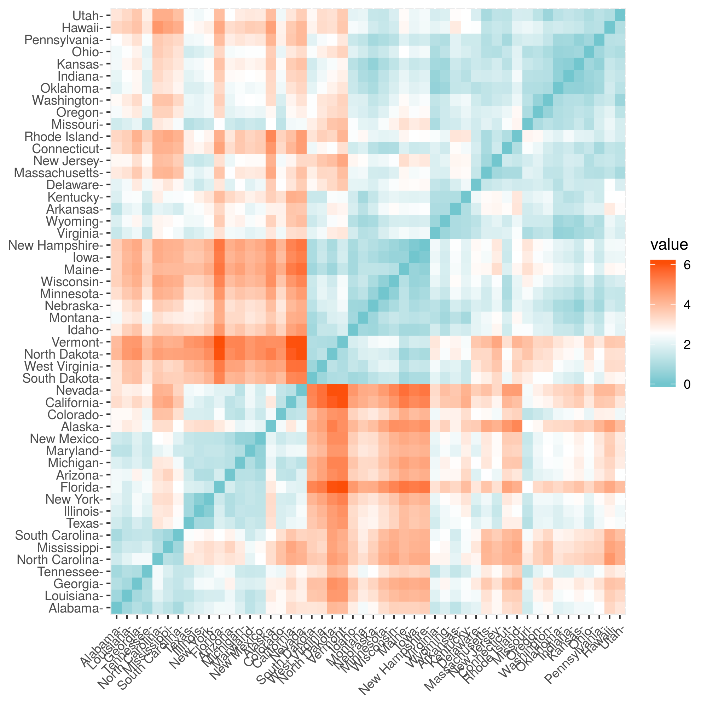
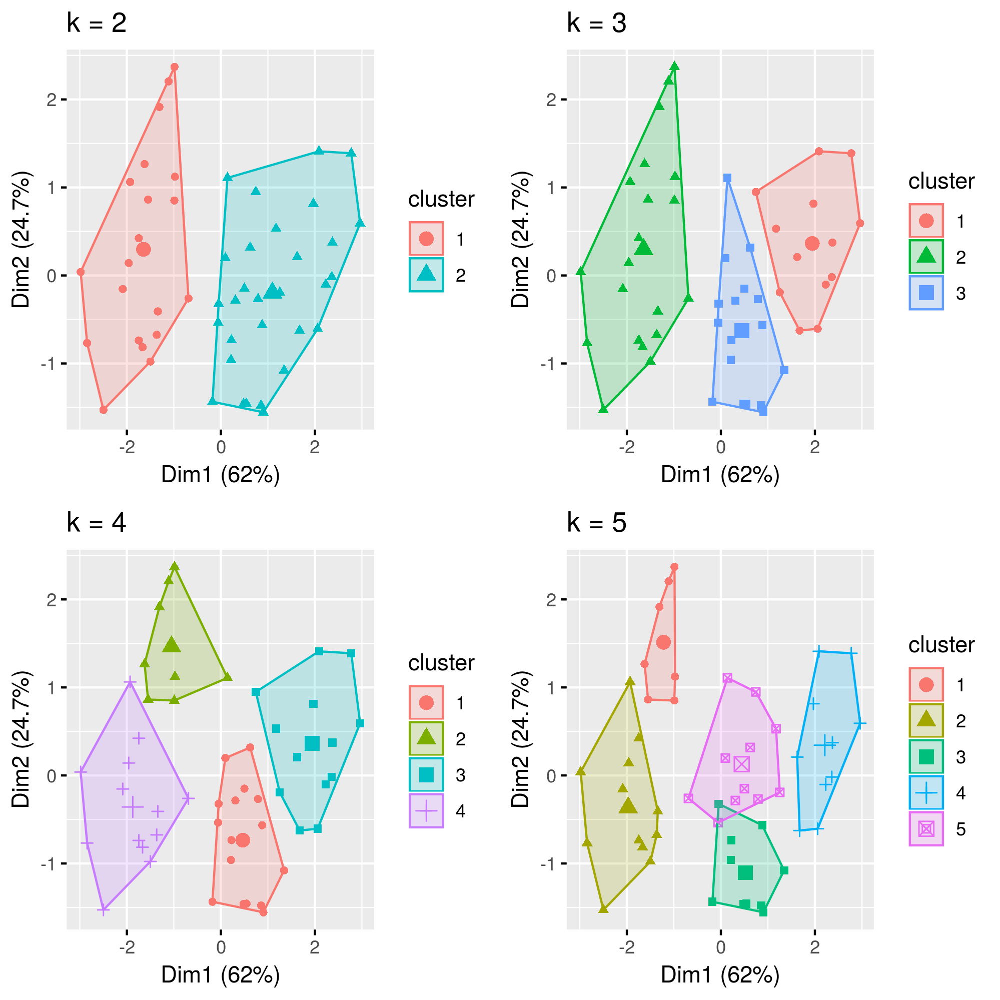
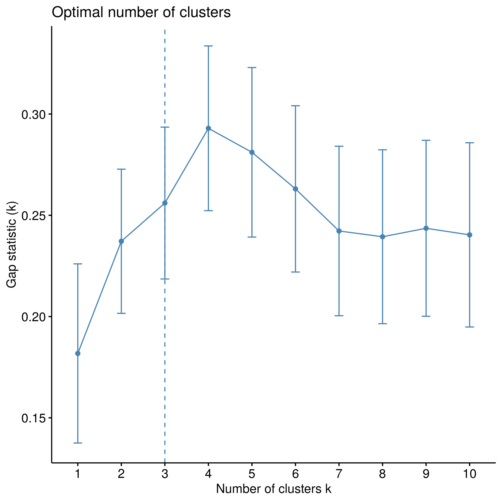
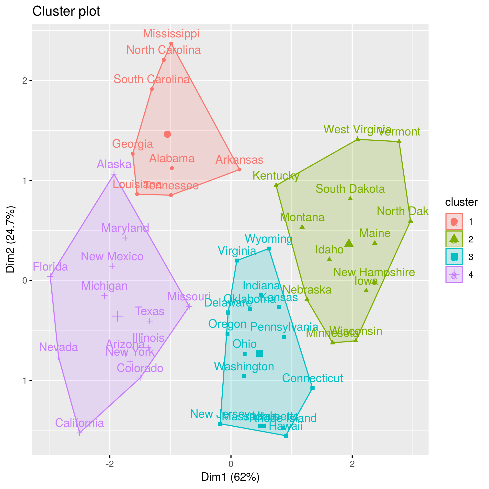

# 美国各州犯罪率数据的聚类分析

## 数据描述

该数据集([USArrests](https://www.kaggle.com/deepakg/usarrests))包含的统计数据是，1973年美国50个州中的每10万居民因袭击，谋杀和强奸而被捕。此外，还给出了居住在城市地区的人口百分比。

即每个州包含四个字段，分别是`Murder`(谋杀)(人数/每10万人), `Assault`(袭击), `UrbanPop`(城镇人口该州比例),`Rape`(抢劫).

## 预处理与EDA

数据质量良好，无重复值和缺失值。

因为聚类涉及距离的度量，所以我们对数据进行标准化。

随后得到的距离矩阵如下。

## 聚类算法

这里我们采用了`KMeans`算法，首先尝试选取不同个数的聚类中心来聚类。

之后采用`Gap Statistic Method`方法定出最优的类中心个数为4.

然后执行最终的聚类程序。最后给出每个聚类中，各种犯罪的平均比率。最后的聚类结果如下。

