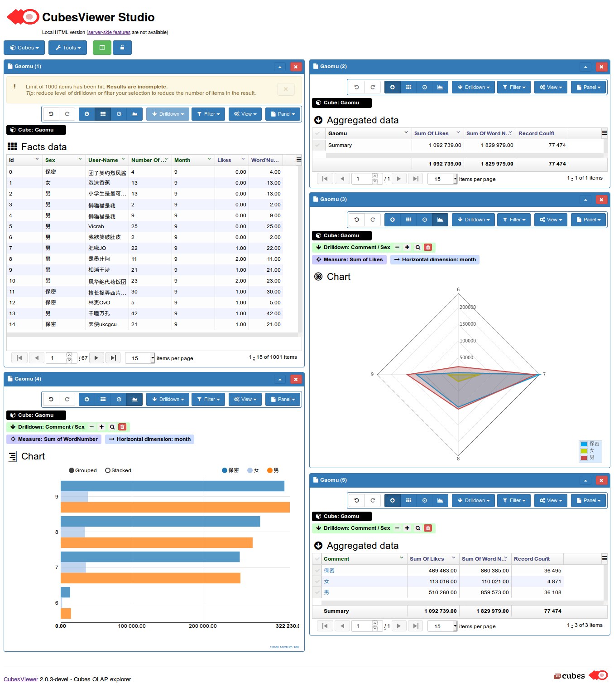

## OLAP系统搭建

### 概览
本次OLAP系统的搭建过程中，使用的数据源来自之前自己写的B站视频评论的爬虫，即[Bilibili-Comments-Spider](https://github.com/shenxiangzhuang/Bilibili-Comments-Spider)。OLAP系统的搭建采用了Python的[Cubes](https://github.com/DataBrewery/cubes)框架，可视化部分采用[Cubesviewer](https://github.com/jjmontesl/cubesviewer)。在使用过程中，对框架本身的执行效率进行了优化（主要是数据库插入数据的优化，极大提升了程序的运行效率）


### 数据集描述
本次数据集(`BilibiliGaomu.csv`)来自B站其中一部番剧的评论数据，共包含`mid, username, rpid, gender,content, ctime, likes, rcount`八个字段，共77474条评论数据。因为框架的具有十分良好的可扩充性，经过简单的预处理(`Preprocessing.py`)，可以十分方便地将之前爬虫采集的数据集成进去。处理后的数据集(`data.csv`)包含如下字段。

<center>

| 字段   |       含义     |
|----------|:-------------:|
| sex |  评论人性别 |
| username |    评论人昵称   |
| likes | 评论获赞数 |
| wordnum | 评论字数 |
| month | 评论月份 |
</center>


#### OLAP系统搭建流程
这里按照Cubes的框架进行搭建。示意图如下：


在我们配置好数据仓库的模型和映射之后，我们可以很好地分离数据的物理应用层和逻辑层，之后可以直接在逻辑层进行数据的探索分析操作，而不必再去关心数据的物理应用层。

针对爬取评论的数据结构，将其数据模型构建如下`model.json`:

```json
{
    "dimensions": [
        {
         "name":"Comment",
         "levels": [
                {
                    "name":"sex",
                    "label":"Sex",
                    "attributes": ["sex"]
                },
                {
                    "name":"username",
                    "label":"User-Name",
                    "attributes": ["username"]
                },
                {
                    "name":"wordnum",
                    "label":"Number of comment words",
                    "attributes": ["wordnum"]
                }
            ]
        },
        {"name":"month", "role": "time"}
    ],
    "cubes": [
        {
            "name": "Gaomu",
            "dimensions": ["Comment", "month"],
            "measures": [{"name":"likes", "label":"Likes"},
                         {"name":"wordnum", "label":"WordNumber"}],
            "aggregates": [
                    {
                        "name": "likes_sum",
                        "function": "sum",
                        "measure": "likes"
                    },
                    {
                        "name": "word_sum",
                        "function": "sum",
                        "measure": "wordnum"
                    },
                    {
                        "name": "record_count",
                        "function": "count"
                    }
                ],
            "mappings": {
                          "Comment.wordnum": "wordnum",
                          "Comment.username": "username",
                          "Comment.sex": "sex"
                         },
            "info": {
                "min_date": "2019-06-01",
                "max_date": "2019-10-01"
            }
        }
    ]
}
```

服务器段配置如下(`slicer.ini`)：

```ini

[workspace]
log_level: info

[server]
host: localhost
port: 5000
reload: yes
prettyprint: yes
allow_cors_origin: *

[store]
type: sql
url: sqlite:///data.sqlite

[models]
main: model.json

```

### 部分可视化结果展示

